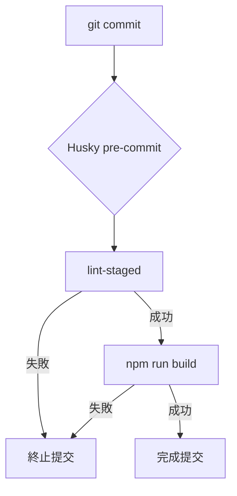

# Research: Husky & lint-staged Best Practices

## 1. 核心決策：Husky v9 整合
Husky 是管理 Git Hooks 的事實標準。版本 9 簡化了初始化流程，不再需要複雜的 `postinstall` 腳本（在某些環境中），改為更直觀的配置。

- **決策**: 使用 Husky v9 進行初始化。
- **理由**: 簡潔、符合主流工具鏈且易於維護。
- **替代方案**: 手動編寫 `.git/hooks` 腳本。拒絕理由：難以跨團隊同步，且無法納入版本控制。

## 2. 效率優化：lint-staged
根據規格 FR-006，`lint` 必須僅針對暫存檔案執行。

- **決策**: 引入 `lint-staged`。
- **理由**: 隨著專案擴大，全域 `lint` 會變得非常緩慢（SC-003 目標 < 60s）。
- **規則配置**:
  - `*.{js,jsx,ts,tsx}`: 執行 `eslint --fix`。
  - `*`: 自動格式化（如 Prettier，若專案有使用）。

## 3. 品質門檻：Build 檢查
雖然 `lint` 可以針對暫存檔案，但 `build` (FR-003) 必須是全局的，以確保代碼變更不會破壞整體依賴或類型完整性。

- **觸發順序**:
  1. `lint-staged` (快速過濾語法錯誤)
  2. `npm run build` (全域類型檢查與編譯驗證)

## 4. 流程可視化 (Visual Documentation)

## 5. 環境要求
- **Node.js**: v24.13.0+ (本機開發環境)。
- **Git**: 必須已初始化（本專案已滿足）。
