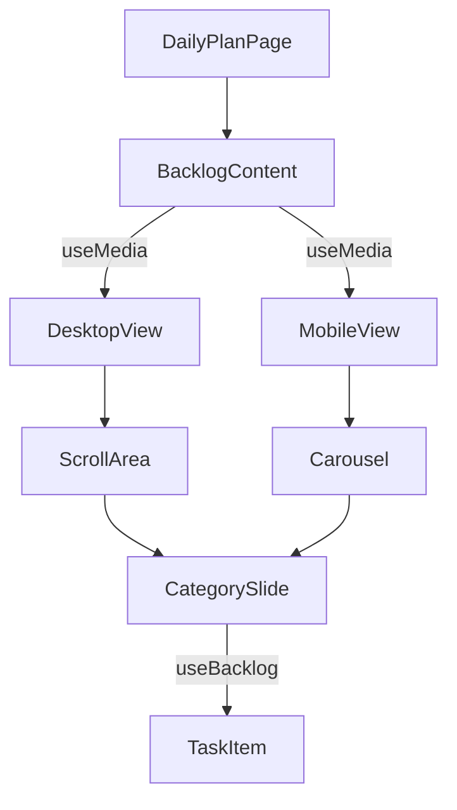

# Implementation Plan: Backlog Carousel & Scrolling Layout

**Branch**: `003-backlog-carousel-layout` | **Date**: 2026-02-03 | **Spec**: [specs/003-backlog-carousel-layout/spec.md](spec.md)
**Input**: Feature specification from `specs/003-backlog-carousel-layout/spec.md`

## Summary

Refactor the Backlog component to support a responsive layout: a horizontal carousel for mobile (Drawer) and a vertical scrollable list for desktop (Side panel). This involves grouping tasks by category and implementing a smooth, gesture-capable transition on mobile using `embla-carousel-react`.

## Technical Context

**Language/Version**: TypeScript 5.x, Node.js v24.13.0+
**Primary Dependencies**: React 18+, TailwindCSS 4, Shadcn UI, embla-carousel-react, react-use (for useMedia)
**Storage**: IndexedDB (via Dexie.js)
**Testing**: Vitest, React Testing Library
**Target Platform**: Web (Mobile-First PWA)
**Project Type**: Web SPA
**Performance Goals**: < 100ms switch time between carousel slides, 60fps scrolling
**Constraints**: Offline-capable, gesture-based navigation on mobile
**Scale/Scope**: Refactor of existing DailyPlanPage and Backlog logic

## Constitution Check

*GATE: Must pass before Phase 0 research. Re-check after Phase 1 design.*

- [x] **I. High Quality & Testability**: Logic for grouping and responsive switching will be unit tested.
- [x] **II. Consistent UX**: Uses Shadcn Carousel and ScrollArea for consistency.
- [x] **III. Performance Centric**: Embla carousel is performant.
- [x] **IV. MVP & No Overdesign**: Focuses strictly on layout requirements.
- [x] **V. Traditional Chinese**: UI and Docs in Traditional Chinese.
- [x] **VI. Visual Documentation**: Component hierarchy described below.

## Project Structure

### Documentation (this feature)

```text
specs/003-backlog-carousel-layout/
├── plan.md              # This file
├── research.md          # Phase 0 output
├── data-model.md        # Phase 1 output
├── quickstart.md        # Phase 1 output
└── tasks.md             # Phase 2 output
```

### Source Code (repository root)

```text
src/
├── components/
│   ├── ui/
│   │   ├── carousel.tsx  # To be added
│   │   └── scroll-area.tsx
├── features/
│   └── daily-plan/
│       ├── BacklogContent.tsx # Refactored component
│       └── CategorySlide.tsx  # Carousel slide component
├── pages/
│   └── DailyPlanPage.tsx      # Main integration
└── hooks/
    └── useBacklog.ts          # Grouping logic hook
```

**Structure Decision**:
Refactor the inline `BacklogContent` in `DailyPlanPage.tsx` into a dedicated feature component.



## Complexity Tracking

| Violation | Why Needed | Simpler Alternative Rejected Because |
|-----------|------------|-------------------------------------|
| (None) | | |
