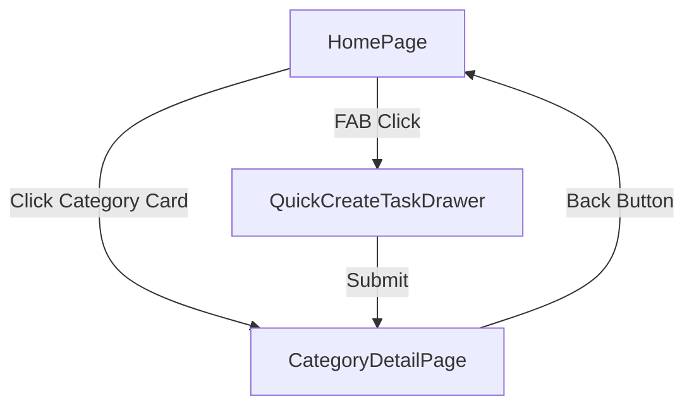

# Implementation Plan: Mobile-First Homepage Refactor

**Branch**: `004-mobile-first-homepage-refactor` | **Date**: 2026-02-03 | **Spec**: [specs/004-mobile-first-homepage-refactor/spec.md](spec.md)
**Input**: Feature specification from `specs/004-mobile-first-homepage-refactor/spec.md`

## Summary

Refactor the homepage to a mobile-first "Overview -> Detail" (Drill-down) architecture. The homepage will focus exclusively on Category cards, utilizing a Floating Action Button (FAB) for ultra-fast task creation via a Drawer. Tapping a category will lead to a full-screen detail view optimized for readability and bulk editing.

## Technical Context

**Language/Version**: TypeScript 5.x, Node.js v24.13.0+
**Primary Dependencies**: React 18+, TailwindCSS 4, Shadcn UI (Drawer, Button, Dialog), Lucide React, react-use (for useMedia)
**Storage**: IndexedDB (via Dexie.js) - existing schema sufficient
**Testing**: Vitest, React Testing Library
**Target Platform**: Mobile-First Web (PWA)
**Project Type**: Web Application
**Performance Goals**: < 300ms category drill-down transition, < 100ms FAB interaction response
**Constraints**: Mobile "thumb zone" accessibility for FAB, full-width readability for tasks
**Scale/Scope**: Homepage refactor + 1 new detail page + 1 new global drawer

## Constitution Check

*GATE: Must pass before Phase 0 research. Re-check after Phase 1 design.*

- [x] **I. High Quality & Testability**: Using standard Shadcn primitives ensures quality; unit tests will cover navigation and filtering logic.
- [x] **II. Consistent UX**: FAB and Drawer patterns align with the DailyPlanPage interaction model.
- [x] **III. Performance Centric**: Drill-down pattern reduces initial render payload; local-first data ensures zero-latency transitions.
- [x] **IV. MVP & No Overdesign**: Focused strictly on visibility and task entry speed; skipping complex dashboard widgets for now.
- [x] **V. Traditional Chinese**: All UI strings and docs will be in Traditional Chinese.
- [x] **VI. Visual Documentation**: Mermaid diagrams used for component and data flow.

## Project Structure

### Documentation (this feature)

```text
specs/004-mobile-first-homepage-refactor/
├── plan.md              # This file
├── research.md          # Phase 0 output
├── data-model.md        # Phase 1 output
├── quickstart.md        # Phase 1 output
└── tasks.md             # Phase 2 output
```

### Source Code (repository root)

```text
src/
├── features/
│   ├── categories/
│   │   ├── CategoryOverview.tsx   # Refactored list for homepage
│   │   └── CategoryCard.tsx       # Tappable summary card
│   └── tasks/
│       ├── QuickCreateTaskDrawer.tsx # New FAB-triggered entry
│       └── CategoryTaskDetail.tsx    # Full-screen task list
├── pages/
│   ├── HomePage.tsx               # Refactored entry point
│   └── CategoryDetailPage.tsx      # New drill-down destination
└── lib/
    └── utils.ts                   # Existing utilities
```

**Structure Decision**: Introduce a "Drill-down" pattern. `HomePage` becomes a high-level aggregator, while `CategoryDetailPage` handles granular task management.



## Complexity Tracking

| Violation | Why Needed | Simpler Alternative Rejected Because |
|-----------|------------|-------------------------------------|
| New Page | To solve readability constraints | Overloading the existing HomePage with more filters was rejected due to mobile screen limitations. |
