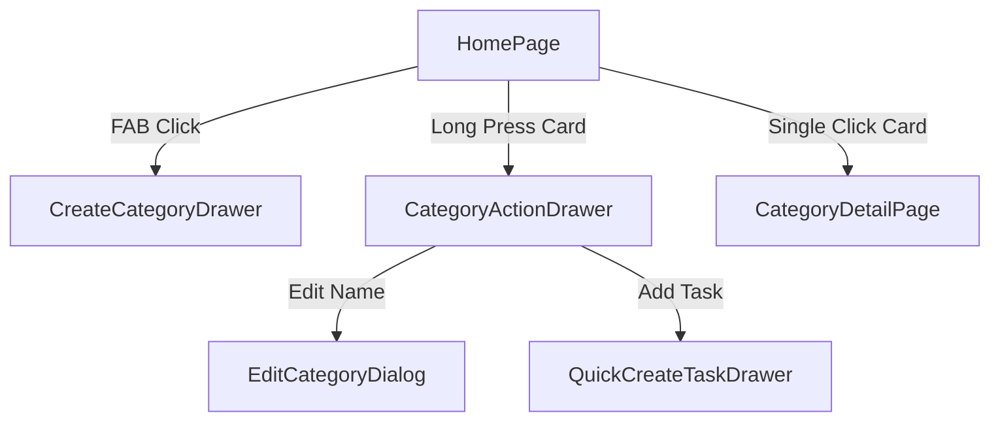

# Implementation Plan: Category Management Refactor

**Branch**: `005-category-management-refactor` | **Date**: 2026-02-03 | **Spec**: [specs/005-category-management-refactor/spec.md](spec.md)
**Input**: Feature specification from `specs/005-category-management-refactor/spec.md`

## Summary

Refactor the homepage interactions to support full CRUD operations for Categories and context-aware Task creation. This involves re-purposing the Floating Action Button (FAB) for Category creation and implementing long-press gestures on Category cards to trigger an Action Drawer for editing and quick task entry.

## Technical Context

**Language/Version**: TypeScript 5.x, Node.js v24.13.0+
**Primary Dependencies**: React 18+, TailwindCSS 4, Shadcn UI (Drawer, Button, Dialog), Lucide React, react-use (for `useLongPress`)
**Storage**: IndexedDB (via Dexie.js)
**Testing**: Vitest, React Testing Library
**Target Platform**: Mobile-First Web (PWA)
**Project Type**: Web Application
**Performance Goals**: < 100ms for gesture feedback, < 300ms for Drawer animation
**Constraints**: Ensure long-press does not conflict with single-click navigation (use `event.preventDefault()` or state flags).
**Scale/Scope**: Homepage refactor + 2 new Drawers + category repository updates.

## Constitution Check

*GATE: Must pass before Phase 0 research. Re-check after Phase 1 design.*

- [x] **I. High Quality & Testability**: Modular Drawers allow for isolated unit testing of form logic.
- [x] **II. Consistent UX**: Uses the same Action Drawer pattern as Task management.
- [x] **III. Performance Centric**: Lightweight gestures and local DB updates ensure smooth interaction.
- [x] **IV. MVP & No Overdesign**: Strictly focused on Category management and Quick Task entry as requested.
- [x] **V. Traditional Chinese**: All UI strings and documentation use Traditional Chinese.
- [x] **VI. Visual Documentation**: Mermaid diagrams used for interaction flow.

## Project Structure

### Documentation (this feature)

```text
specs/005-category-management-refactor/
├── plan.md              # This file
├── research.md          # Phase 0 output
├── data-model.md        # Phase 1 output
├── quickstart.md        # Phase 1 output
└── tasks.md             # Phase 2 output (generated by /speckit.tasks)
```

### Source Code (repository root)

```text
src/
├── features/
│   ├── categories/
│   │   ├── CreateCategoryDrawer.tsx  # New: FAB-triggered category creation
│   │   ├── CategoryActionDrawer.tsx  # New: Long-press triggered actions
│   │   └── CategoryOverview.tsx      # Modified: To include gesture handling
│   └── tasks/
│       └── QuickCreateTaskDrawer.tsx # Existing: Modified to accept default category
├── pages/
│   └── HomePage.tsx                  # Modified: FAB logic change
└── lib/
    └── repository.ts                 # Modified: Category update/delete helpers
```

**Structure Decision**: Leverage `react-use`'s `useLongPress` hook to isolate gesture logic. Modularize forms into separate Drawer components to keep `HomePage.tsx` clean.



## Complexity Tracking

| Violation | Why Needed | Simpler Alternative Rejected Because |
|-----------|------------|-------------------------------------|
| Long-press Gesture | To enable mobile-first secondary actions | Desktop-only right-click is inaccessible on mobile; menus on cards clutter the UI. |