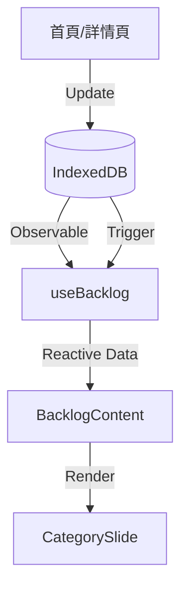

# Implementation Plan: Backlog Data Synchronization Fix

**Branch**: `006-sync-backlog-data` | **Date**: 2026-02-03 | **Spec**: [specs/006-sync-backlog-data/spec.md](spec.md)
**Input**: Feature specification from `specs/006-sync-backlog-data/spec.md`

## Summary

Fix the data synchronization bug where the Backlog in the Daily Plan page does not reflect real-time updates made to Categories, Tasks, and SubTasks. The fix involves ensuring that the data retrieval logic uses reactive queries (via Dexie's `useLiveQuery`) and correctly maps data entities to their latest states.

## Technical Context

**Language/Version**: TypeScript 5.x, Node.js v24.13.0+
**Primary Dependencies**: React 18+, Dexie.js, dexie-react-hooks
**Storage**: IndexedDB (via Dexie.js)
**Testing**: Vitest, React Testing Library
**Target Platform**: Web (Mobile-First)
**Project Type**: Web Application
**Performance Goals**: < 100ms UI update latency (SC-001)
**Constraints**: Must strictly use reactive patterns to avoid manual refresh.
**Scale/Scope**: Focus on `useBacklog` hook and components in `src/features/daily-plan/`.

## Constitution Check

- [x] **I. High Quality & Testability**: Fix will be verified with unit tests for the reactive hook.
- [x] **II. Consistent UX**: Ensures users see consistent data across all pages.
- [x] **III. Performance Centric**: Reactive queries minimize unnecessary re-renders.
- [x] **IV. MVP & No Overdesign**: Focuses strictly on fixing the synchronization bug.
- [x] **V. Traditional Chinese**: All documentation and UI strings in Traditional Chinese.
- [x] **VI. Visual Documentation**: Data flow documented via Mermaid.

## Project Structure

### Documentation (this feature)

```text
specs/006-sync-backlog-data/
├── plan.md              # This file
├── research.md          # Phase 0 output
├── data-model.md        # Phase 1 output
└── tasks.md             # Phase 2 output
```

### Source Code (repository root)

```text
src/
├── hooks/
│   └── useBacklog.ts          # Core logic for reactive backlog data
├── features/
│   └── daily-plan/
│       ├── BacklogContent.tsx # UI component consuming useBacklog
│       └── CategorySlide.tsx  # UI component for category groupings
└── lib/
    └── db.ts                  # Database schema definitions
```

**Structure Decision**: Centralize the reactive query logic in the `useBacklog` hook. This ensures that any UI component needing backlog data receives the most current state automatically.



## Complexity Tracking

| Violation | Why Needed | Simpler Alternative Rejected Because |
|-----------|------------|-------------------------------------|
| (None) | | |