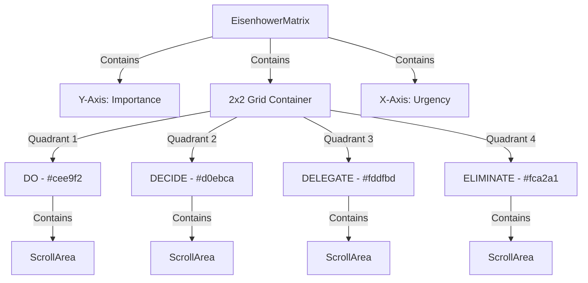

# Implementation Plan: Eisenhower Matrix UI Refactor

**Branch**: `007-matrix-ui-refactor` | **Date**: 2026-02-03 | **Spec**: [specs/007-matrix-ui-refactor/spec.md](spec.md)
**Input**: Feature specification from `specs/007-matrix-ui-refactor/spec.md`

## Summary

Refactor the Eisenhower Matrix from a card-based layout to a flat, high-density 2x2 quadrant visualization. The new UI will use specific background colors for each quadrant (Q1: #cee9f2, Q2: #d0ebca, Q3: #fddfbd, Q4: #fca2a1) and eliminate internal headers in favor of external X (Urgency) and Y (Importance) axis labels. To maximize screen real estate, the page title and descriptions are removed, and navigation filters are moved to a Floating Action Button (FAB). Crucially, the implementation will introduce independent scrolling for each quadrant to prevent layout overflow on mobile devices.

## Technical Context

**Language/Version**: TypeScript 5.x, Node.js v24.13.0+
**Primary Dependencies**: React 18+, TailwindCSS 4, Lucide React, Radix UI (Scroll Area), Shadcn UI (Dropdown Menu / FAB)
**Storage**: IndexedDB (via Dexie.js) - existing schema remains unchanged.
**Testing**: Vitest, React Testing Library
**Target Platform**: Mobile-First Web
**Project Type**: Web Application
**Performance Goals**: < 100ms render for 100+ tasks, 60fps scrolling within quadrants.
**Constraints**: 2x2 grid must occupy > 90% of visual viewport height on mobile; axis labels must be tightly aligned to grid edges.
**Scale/Scope**: Refactoring `EisenhowerMatrix.tsx`, updating `MatrixPage.tsx`, and adding FAB filter logic.

## Constitution Check

*GATE: Must pass before Phase 0 research. Re-check after Phase 1 design.*

- [x] **I. High Quality & Testability**: Refactor will be verified with visual regression considerations and existing unit tests for task filtering.
- [x] **II. Consistent UX**: The flat quadrant pattern is a common productivity app standard; axis labels simplify the interface.
- [x] **III. Performance Centric**: Using `ScrollArea` instead of full-page scrolling prevents massive layout shifts.
- [x] **IV. MVP & No Overdesign**: Strictly focused on the requested visual and structural improvements.
- [x] **V. Traditional Chinese**: All labels and axis markers will be in Traditional Chinese.
- [x] **VI. Visual Documentation**: Mermaid diagram used to describe the grid and axis alignment.

## Project Structure

### Documentation (this feature)

```text
specs/007-matrix-ui-refactor/
├── plan.md              # This file
├── research.md          # Phase 0 output
├── data-model.md        # Phase 1 output (Summary of view state)
└── tasks.md             # Phase 2 output
```

### Source Code (repository root)

```text
src/
├── features/
│   └── tasks/
│       ├── EisenhowerMatrix.tsx   # Major refactor: grid & axis implementation
│       └── MatrixQuadrant.tsx     # New: Modular component for a single colored block
└── components/
    └── ui/
        └── scroll-area.tsx        # Existing: Used for internal quadrant scrolling
```

**Structure Decision**: Extract the quadrant logic into a dedicated `MatrixQuadrant` component to manage background colors and independent scroll states cleanly.



## Complexity Tracking

| Violation | Why Needed | Simpler Alternative Rejected Because |
|-----------|------------|-------------------------------------|
| CSS Grid with Axis Labels | To match "Flat Quadrant" requirement | Standard card-based lists were rejected by the user for being unintuitive and vertically excessive on mobile. |
