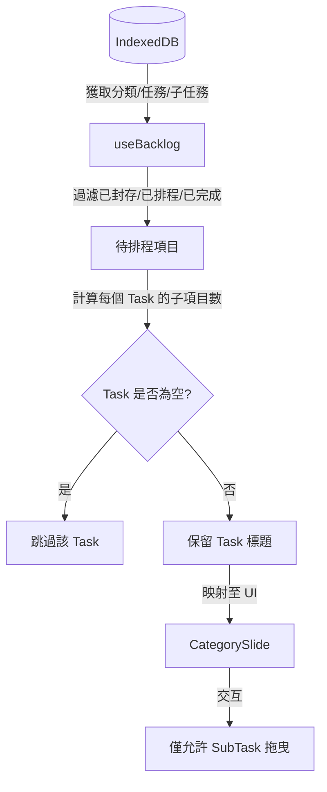

# 實作計畫：Backlog 過濾優化

**分支**: `008-refine-backlog-filtering` | **日期**: 2026-02-03 | **規格**: [specs/008-refine-backlog-filtering/spec.md](spec.md)
**輸入**: 來自 `specs/008-refine-backlog-filtering/spec.md` 的功能規格

## 摘要 (Summary)

重構 Backlog 資料擷取邏輯，以強制執行「僅子任務可排程」規則。這包括停用父層任務標題的拖曳狀態，並實作自動隱藏機制：當任務下所有子任務皆已完成或已排入每日計畫時，該任務將自動從 Backlog 中隱藏。

## 技術上下文 (Technical Context)

**語言/版本**: TypeScript 5.x, Node.js v24.13.0+
**主要依賴**: React 18+, Dexie.js, dexie-react-hooks, @dnd-kit/core
**儲存**: IndexedDB (經由 Dexie.js) - 維持現有 Schema
**測試**: Vitest, React Testing Library
**目標平台**: 行動優先網頁 (PWA)
**專案類型**: Web 應用程式
**效能目標**: `useBacklog` hook 的資料轉換耗時 < 50ms。
**約束**: 必須嚴格遵循「僅子任務」規則；父層任務僅作為視覺錨點。
**範疇**: 重構 `useBacklog.ts` 與 `CategorySlide.tsx`。

## 憲章檢查 (Constitution Check)

- [x] **I. 高品質與可測試性**: 重構邏輯將由 `useBacklog.test.ts` 中的單元測試驗證。
- [x] **II. 使用者體驗一致性**: 防止誤將整個任務組排入計畫，使每日計畫更簡潔。
- [x] **III. 效能優先**: 過濾邏輯發生在資料轉換階段，減少 UI 不必要的更新。
- [x] **IV. MVP 與避免過度設計**: 槓桿既有狀態，無需進行資料庫遷移。
- [x] **V. 全面正體中文**: 內部註解與文檔更新皆使用正體中文。
- [x] **VI. 圖像化與可視化溝通**: 下方包含描述過濾流程的 Mermaid 圖表。

## 專案結構

### 文檔 (本功能)

```text
specs/008-refine-backlog-filtering/
├── plan.md              # 本文件
├── research.md          # 階段 0 產出
├── data-model.md        # 階段 1 產出
├── quickstart.md        # 階段 1 產出
└── tasks.md             # 階段 2 產出
```

### 原始碼

```text
src/
├── hooks/
│   └── useBacklog.ts          # 核心重構：動態隱藏與任務容器邏輯
└── features/
    └── daily-plan/
        └── CategorySlide.tsx  # UI 重構：停用任務標題的拖曳功能
```

**架構決策**: 在 `useBacklog` hook 內部完成資料轉換，產出預先過濾後的群組。UI 層只需遵循 `refType === 'SUBTASK'` 的規則處理交互。



## 複雜度追蹤

| 違反規則 | 為何需要 | 已拒絕的更簡單方案及其原因 |
|-----------|------------|-------------------------------------|
| (無) | | |