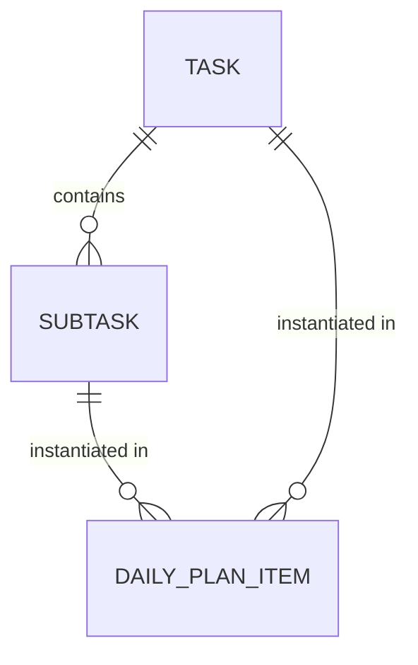

# Data Model: SubTask Recurring Types (Schema v4)

## Entities

### SubTask (Updated)
Represent a definition of a subtask.

| Field | Type | Description |
|-------|------|-------------|
| id | string (UUID) | Unique ID |
| taskId | string (Ref) | Parent Task ID |
| title | string | Subtask title |
| isCompleted | boolean | Overall completion status (for One-time) |
| type | string | 'one-time' (default), 'multi-time', 'daily' |
| repeatLimit | number | Target count for 'multi-time' (e.g. 3) |
| eisenhower | string | 'Q1'-'Q4' |
| createdAt | ISO8601 | Timestamp |
| updatedAt | ISO8601 | Timestamp |

### DailyPlanItem (Updated)
Represents an instance of a task or subtask in a specific day's plan.

| Field | Type | Description |
|-------|------|-------------|
| id | string (UUID) | Unique ID |
| date | string | YYYY-MM-DD |
| refId | string | Task ID or SubTask ID |
| refType | string | 'TASK' or 'SUBTASK' |
| orderIndex | number | Sorting order |
| isRollover | boolean | If it was moved from yesterday |
| isCompleted | boolean | **NEW**: Completion status for this instance |
| updatedAt | ISO8601 | Timestamp |

## Relationships

## State Transitions & Progress

### Multi-time SubTask Progress Calculation
- **Numerator**: `COUNT(DailyPlanItem WHERE refId == SubTask.id AND isCompleted == true)`
- **Denominator**: `SubTask.repeatLimit`
- **UI State**: `numerator / denominator` (e.g., "1/3")
- **Alert State**: If `numerator > denominator`, display in red.

### Completion Impact
- **One-time**: Updating `DailyPlanItem.isCompleted` updates `SubTask.isCompleted` and vice-versa.
- **Multi-time/Daily**: Updating `DailyPlanItem.isCompleted` ONLY updates the instance. `SubTask.isCompleted` reflects if the `numerator >= denominator` (for multi-time).
