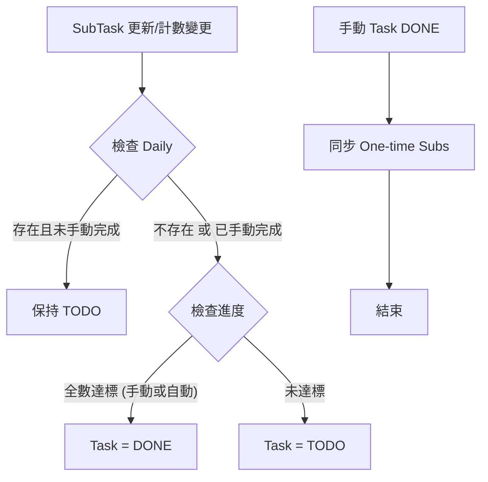

# Research: Task Completion Engine & Reactive Sync

## 1. 核心邏輯：狀態計算引擎 (Status Engine)

根據規格 FR-001 與最新釐清事項，我們需要一個能夠根據 SubTask 集合動態推導 Task 狀態的邏輯層。

### 規則定義：
- **條件 A (Daily 任務)**: 
  - 若 `SubTask.type == 'daily'` 且 `isCompleted == false` -> 視為活動中，阻止父任務自動完成。
  - 若 `SubTask.type == 'daily'` 且 `isCompleted == true` (手動標記) -> 視為已結案，不阻止父任務自動完成。
- **條件 B (Multi-time 任務)**: 
  - 自動完成：`completedCount >= repeatLimit`。
  - 手動完成：`isCompleted == true` (優先於計數)。
- **推導結果**: 如果 `EVERY(SubTask 滿足完成條件)` 且 `NOT 條件 A` -> `Task.status = DONE`。

## 2. 觸發時機與效能 (SC-004)

為了確保效能與資料一致性，計算應在以下操作發生後立即觸發：
1. **SubTask 定義更新**: 修改 `type`、`repeatLimit` 或手動切換 `isCompleted`。
2. **DailyPlanItem 完成狀態變更**: 勾選/取消 Checkbox 時，會更新 `SubTask.completedCount`。
3. **新增/刪除 SubTask**: 集合變動會影響 `EVERY` 的計算結果。

**技術決策**: 
- 在 `repository.ts` 的 `subtasks.syncParentTaskStatus` 中實作核心邏輯。
- 效能目標 < 100ms：透過索引查詢 `subtasks`，單次查詢量極小 (通常 < 20 筆)，IndexedDB 可輕鬆達成。

## 3. 手動覆寫與同步 (FR-006)

當使用者手動將 Task 改為 `DONE` 時：
- `One-time`: 自動同步為 `isCompleted = true`。
- `Multi-time/Daily`: **不同步**。維持 FR-006 的原意，保留歷史進度。若使用者希望將這些子任務也標記為完成，需個別操作子任務。

**理由**: 避免因父任務的一鍵完成而破壞循環任務的長期追蹤數據。

## 4. 可視化邏輯流 (Visual Documentation)

