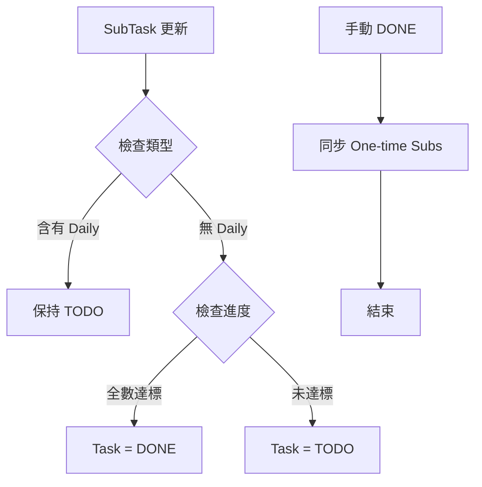

# Research: Task Completion Engine & Reactive Sync

## 1. 核心邏輯：狀態計算引擎 (Status Engine)

根據規格 FR-001，我們需要一個能夠根據 SubTask 集合動態推導 Task 狀態的邏輯層。

### 規則定義：
- **條件 A (包含每日任務)**: 如果 `SOME(SubTask.type == 'daily')` -> 永遠不自動完成。
- **條件 B (多次性/一次性)**: 
  - `One-time`: `SubTask.isCompleted == true` 視為 Done。
  - `Multi-time`: `SubTask.completedCount >= SubTask.repeatLimit` 視為 Done。
- **推導結果**: 如果 `EVERY(SubTask 滿足條件 B)` 且 `NOT 條件 A` -> `Task.status = DONE`。

## 2. 觸發時機與效能 (SC-004)

為了確保效能與資料一致性，計算應在以下操作發生後立即觸發：
1. **SubTask 定義更新**: 修改 `type` 或 `repeatLimit`。
2. **DailyPlanItem 完成狀態變更**: 勾選/取消 Checkbox 時，會更新 `SubTask.completedCount` 或 `SubTask.isCompleted`。
3. **新增/刪除 SubTask**: 集合變動會影響 `EVERY` 的計算結果。

**技術決策**: 
- 在 `repository.ts` 的 `subtasks.syncParentTaskStatus` 中實作核心邏輯。
- 使用 Dexie 索引優化 `completedCount` 的計算（已在 022 完成初步優化）。

## 3. 手動覆寫與同步 (FR-006)

當使用者手動將 Task 改為 `DONE` 時：
- `One-time`: 自動同步為 `isCompleted = true`。
- `Multi-time/Daily`: 保持現有進度（Preserve history），不強改進度。

**理由**: `multi-time` 的 `completedCount` 代表真實發生的次數，不應因 Task 完成而虛假增加。

## 4. 可視化邏輯流 (Visual Documentation)

