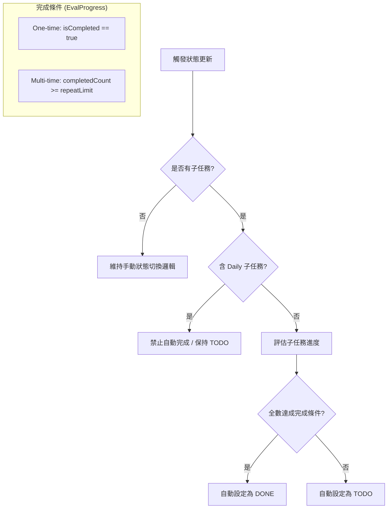

# Feature Specification: Redefine Task Completion Logic

**Feature Branch**: `024-redefine-task-completion`  
**Created**: 2026-02-12  
**Status**: Draft  
**Input**: User description: "因為我們新增了 @specs/022-subtask-recurring-types/ 這些功能，我認為需要進一步分析一下 Task 的完成狀態該如何定義，因為 SubTask 目前可能有 '多次性任務', '每日任務'，因此 Task 該如何定義'完成'需要針對此 app 的應用做一次重新的定義; 另外每次你在新增 branch 和新增 /specs 的資料命名時，請先看一下 @/specs 裡現有的資料夾名稱在按照流水號序列命名"

## User Scenarios & Testing *(mandatory)*

### User Story 1 - Automatic Completion Logic (Priority: P1)

As a user, I want the system to automatically calculate the "DONE" status of a Task based on its subtasks' types and progress, so that I don't have to manually manage high-level status for standard workflows.

**Why this priority**: Core logic shift required to support recurring subtasks. Prevents data inconsistency between Task status and SubTask progress.

**Independent Test**: Create tasks with different subtask combinations (only one-time, mixed with multi-time, mixed with daily) and verify when the parent Task status flips to "DONE".

**Acceptance Scenarios**:

1. **Given** a Task with only "One-time" subtasks, **When** all subtasks are marked completed, **Then** the Task MUST automatically transition to "DONE".
2. **Given** a Task with "Multi-time" subtasks, **When** all multi-time subtasks reach their limit AND all one-time subtasks are done, **Then** the Task MUST automatically transition to "DONE".
3. **Given** a Task containing at least one "Daily" subtask, **When** subtasks are updated, **Then** the Task SHOULD NOT automatically transition to "DONE" regardless of daily item completion.

---

### User Story 2 - Manual Completion Override (Priority: P2)

As a user, I want to be able to manually mark a Task as "DONE" even if it contains "Daily" subtasks, so that I can formally end a recurring responsibility.

**Why this priority**: Essential for user agency and terminating recurring flows.

**Independent Test**: Manually toggle a Task with "Daily" subtasks to "DONE" and verify it persists and hides from backlog.

**Acceptance Scenarios**:

1. **Given** a Task with active "Daily" subtasks, **When** I manually set the Task to "DONE", **Then** the system MUST allow it and sync only one-time subtasks.

## Logic Visualization (Mandatory per Constitution VI)

### Edge Cases

- **Mixed Types**: Task stays "TODO" automatically as long as a "Daily" subtask is active, or if "Multi-time" subtasks haven't reached their limits.
- **Decrementing Progress**: If a user unchecks a "Multi-time" instance in the Daily Plan, reducing the count below the limit, the Task status MUST revert from "DONE" to "TODO" (Dynamic Update).
- **Manual Override Persistence**: If a Task is manually marked as "DONE", adding a new incomplete subtask will trigger the auto-logic to revert the Task to "TODO" to maintain data integrity.
- **No Subtasks**: A Task with no subtasks follows manual status toggle logic.

## Requirements *(mandatory)*

### Functional Requirements

- **FR-001**: The system MUST implement a reactive "Completion Calculator" for Tasks.
- **FR-002**: **One-time SubTask Logic**: `SubTask.isCompleted` is toggled via Checkbox. Affects Task completion directly.
- **FR-003**: **Multi-time SubTask Logic**: Daily Plan Checkbox increments/decrements `SubTask.completedCount`. The subtask definition is considered "done" for the Task only if `completedCount >= repeatLimit`.
- **FR-004**: **Daily SubTask Logic**: Daily Plan Checkbox marks the daily instance as done but DOES NOT affect `SubTask.isCompleted` in the definition. Tasks with Daily items never auto-complete.
- **FR-005**: **Auto-DONE Trigger**: A Task becomes "DONE" if all its SubTasks (definitions) are "done". If ANY SubTask is "Daily", auto-completion is disabled. If a Task has zero subtasks, auto-completion MUST NOT trigger to avoid vacuously true states.
- **FR-006**: **Manual DONE Sync**: When a Task is manually marked "DONE", the system MUST mark all its `one-time` subtasks as `isCompleted = true`. `multi-time` and `daily` subtasks are NOT modified to preserve history.
- **FR-007**: **Dynamic Reversion**: If a Task is "DONE" and a subtask is added or unchecked (reducing progress), the Task MUST revert to "TODO".

### Key Entities

- **Task Status Engine**: Evaluates the collection of subtasks and their cumulative progress to update `Task.status`.

## Success Criteria *(mandatory)*

### Measurable Outcomes

- **SC-001**: 100% of Tasks without Daily items auto-transition to DONE upon meeting all subtask goals.
- **SC-002**: 100% of Tasks with Daily items require manual action to reach DONE status.
- **SC-003**: UI reflects Task status changes immediately (< 100ms) after subtask completion.
- **SC-004**: Manual "DONE" actions correctly skip modifying recurring subtask historical data.
