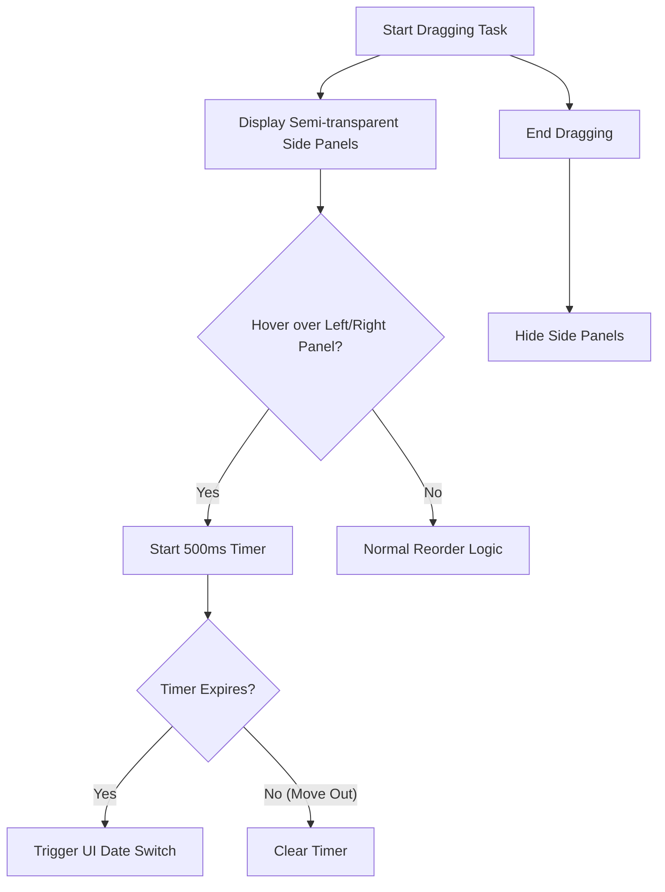

# Research: Daily Plan Gestures & Filters

## Decision: Side Guide Panels for Gestural Navigation

### 1. Visual Guidance Strategy
**Decision**: Implement "Side Guide Panels" that appear only during an active drag operation.
**Rationale**: Enhances discoverability (UX goal) while keeping the default UI clean. Side panels provide a large target area, making the "甩動" (flick) gesture intuitive.
**Alternatives considered**: 
- Constant visible icons: Rejected as too cluttered.
- Dragging to navigation arrows: Re-evaluated as insufficient for discoverability (User hint).

### 2. Gesture Handling with `dnd-kit`
**Decision**: Use `useDroppable` for the left and right 15% edges of the screen.
**Rationale**: `dnd-kit` is already the foundation of our drag logic. Mapping edges as droppable zones is consistent with existing patterns.
**Implementation**:
- Add two invisible absolute-positioned `Droppable` components at the edges.
- Use Framer Motion to animate their appearance (opacity/blur) when `activeId` is present.

### 3. Hover-to-Switch Logic
**Decision**: 500ms debounce timer on `onDragOver`.
**Rationale**: Prevents accidental date jumps while still allowing preview.
**Logic**: 
- `onDragOver` -> Start `setTimeout(500ms)`.
- `onDragLeave` or `onDragEnd` -> `clearTimeout`.

### 4. Filter-Aware Reordering
**Decision**: Virtual index mapping.
**Rationale**: Users expect to reorder visible items without affecting the hidden "daily" items' relative positions.
**Logic**:
- Fetch all items for the day.
- Partition into `visible` and `hidden`.
- Apply reorder to `visible`.
- Merge back into database with normalized `orderIndex` values that preserve the new relative order of visible items.

## Visual Logic Flow: Side Panel Trigger

