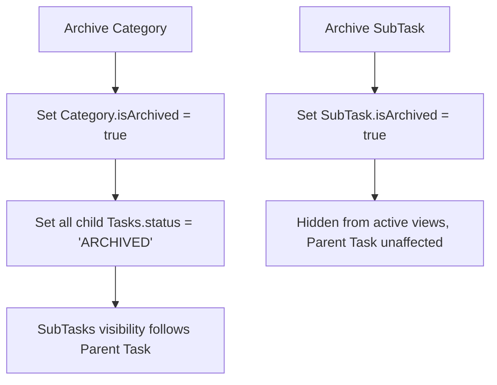

# Research: Restore Archive Management

## Decision: Schema Version 6 & Unified Archive View

### 1. Data Schema Update
**Decision**: Upgrade IndexedDB to **Version 6**. Add `isArchived` index to `subtasks` table.
**Rationale**: `SubTask` currently lacks an explicit archival state. Adding this allows granular control (archiving a subtask without archiving the whole task).
**Migration Path**: Version 6 will initialize `isArchived: false` for all existing subtasks.

### 2. UI Entry Point: Category Management Sidebar
**Decision**: Add an "已封存項目" (Archived Items) link at the bottom of the Category Management sidebar/drawer.
**Rationale**: This keeps administrative actions grouped together. The Category management area already handles "Delete/Archive" logic for categories, making it the most contextually relevant place.

### 3. Archive Management UI
**Decision**: A dedicated page (`/archive`) with a segmented control or tabs to switch between "Categories", "Tasks", and "SubTasks".
**Rationale**: Allows users to manage different levels of data independently. 
**Restore Logic**:
- Restoring a **Task**: Check if parent Category is archived. If yes, prompt to restore Category or move Task to another Category.
- Restoring a **SubTask**: Same logic applies to parent Task.

### 4. Visual Documentation (Principle VI)
**Visual Logic Flow: Archival State Cascade**

## Alternatives Considered
- **Settings Modal**: Rejected because it's too deep. Archive management is a frequent cleanup task.
- **Delete = Archive**: Rejected. We should maintain the distinction between "Soft delete" (Archive) and "Hard delete" (Remove).
