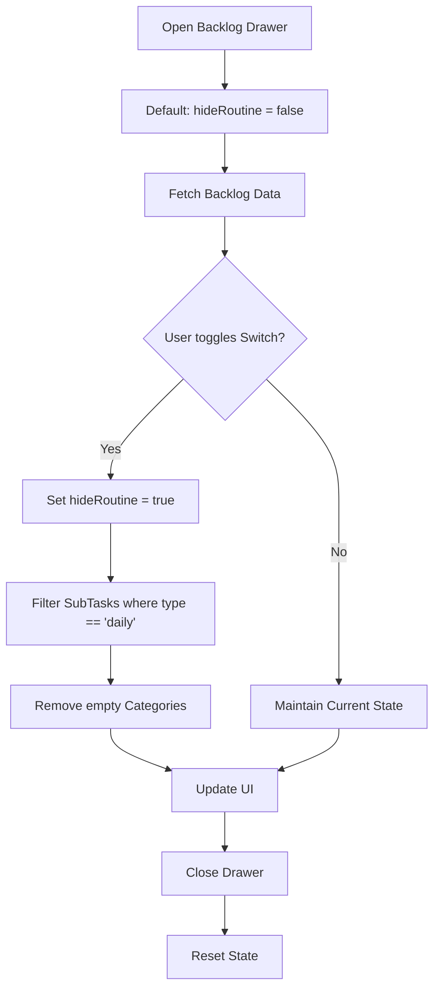

# Research: Backlog Routine Filter

## Decision: Local State Management for Backlog Filter

### 1. Filter Logic Implementation
**Decision**: Re-use the filtering logic pattern from `DailyPlanView.tsx` but apply it within the `Backlog` components.
**Rationale**: Consistency (Principle II) and efficiency. We already have a proven logic for filtering `daily` subtasks based on their `type`.
**Implementation**: 
- Update `useBacklog` hook or the consuming component to accept a `hideRoutine` parameter.
- Filter the `subtasks` array within each `BacklogGroup` before rendering.
- If a group has no subtasks left after filtering, exclude the group entirely (FR-003).

### 2. State Persistence & Synchronization
**Decision**: Use `useState` within the `Backlog` drawer component for the filter toggle.
**Rationale**: User decision (Q1: B, Q2: B) specifies that the state should be independent and reset on close.
**Implementation**: 
- The toggle state will live in the `Backlog` drawer component.
- It will NOT be synced with any global store or the `DailyPlanView` state.
- When the drawer is unmounted (closed), the state naturally resets.

### 3. UI Consistency
**Decision**: Use the same `Switch` and `Label` style from `PlanToolbar.tsx`.
**Rationale**: UX consistency (Principle II). Users should recognize the toggle as the same function they use on the main plan page.

## Visual Logic Flow: Backlog Filtering

