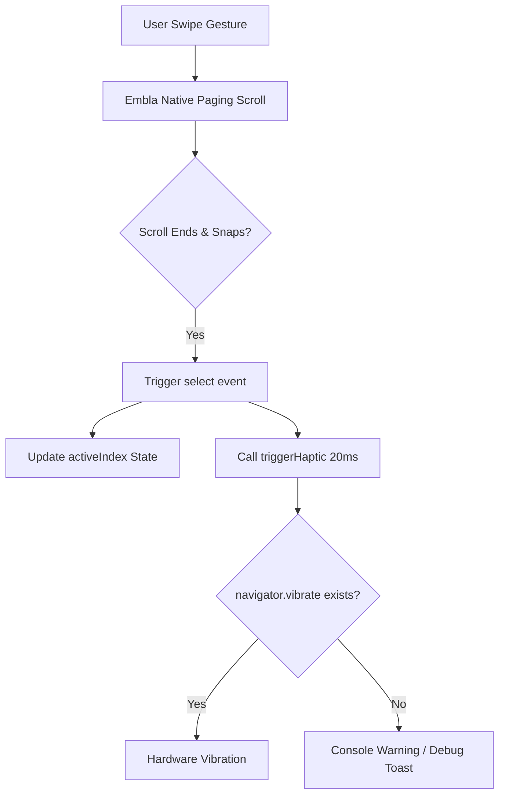

# Research: Backlog Carousel Swipe Optimization

## Decision: Paging Interaction & Haptic Debugging

### 1. Carousel Interaction Model Change
**Decision**: Switch from 1:1 motion-linked scaling to a "paging" (discrete snapping) model.
**Rationale**: The user reported that the previous linked animation felt "laggy" or jittery. Moving to a paging model simplifies the per-frame calculation and provides a clearer, more predictable UI state transition.
**Implementation**:
- Remove Embla `scroll` event listener that updates `MotionValue`.
- Configure Embla with `containScroll: 'trimSnaps'` and adjust `duration` for snappier snapping.
- Use CSS or simple conditional state for highlighting the active slide instead of continuous transforms.

### 2. Haptic Feedback (Vibration) Debugging
**Decision**: Implement a "Haptic Debug Mode" that displays a visual Toast when a vibration is triggered.
**Rationale**: iOS Safari does not support `navigator.vibrate`. A visual debug signal allows the user/developer to verify that the software logic is triggering correctly, even if the hardware/browser doesn't respond.
**Implementation**:
- Add a utility function `triggerHaptic(duration)` that calls `navigator.vibrate` and optionally shows a `sonner` toast.
- Increase vibration duration to 20ms to ensure perceptibility on Android devices.

### 3. Performance Bottleneck Analysis
**Decision**: Audit `BacklogContent.tsx` for unnecessary re-renders.
**Rationale**: The "lag" might be caused by React component updates during carousel events.
**Strategy**:
- Ensure the carousel API (`setApi`) doesn't trigger parent re-renders.
- Use `React.memo` for slide components to prevent cascading updates.

## Visual Logic Flow: Carousel Events

